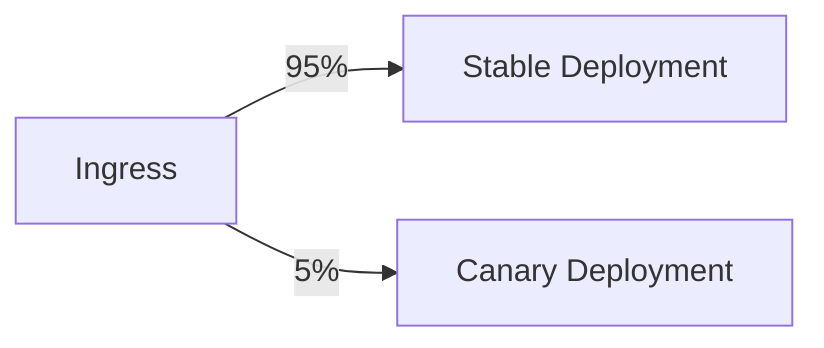

# Kubernetes Deployment Strategies: Scenario-Based Interview Questions
A collection of scenario-based interview questions focused on Kubernetes Deployment.

## Table of Contents
1. [Deployment Basics](#1-deployment-basics)
2. [Rolling Update Scenario](#2-rolling-update-scenario)
3. [Blue-Green Deployment Challenge](#3-blue-green-deployment-challenge)
4. [Canary Release Implementation](#4-canary-release-implementation)
5. [Rollback Emergency Situation](#5-rollback-emergency-situation)
6. [Deployment Best Practices](#6-deployment-best-practices)
7. [Core Deployment Concepts](#7-core-deployment-concepts)  
8. [Rolling Update Troubleshooting](#8-rolling-update-troubleshooting)  
9. [Recreate Strategy for Stateful Apps](#9-recreate-strategy-for-stateful-apps)  
10. [Canary Deployment Implementation](#10-canary-deployment-implementation)  
11. [Blue-Green with Database Migration](#11-blue-green-with-database-migration)  
12. [Advanced Strategy Selection](#12-advanced-strategy-selection)  

---

## 1. Deployment Basics

**Question:** What is the difference between a Deployment and a ReplicaSet in Kubernetes, and why would you use a Deployment?

**Key Points:**
- Deployments provide declarative updates for Pods and ReplicaSets
- Key advantages over ReplicaSets:
  - Rollout history and rollback capabilities (`kubectl rollout history`)
  - Multiple rollout strategies (rolling update, recreate)
  - Pause/resume functionality for canary testing
- Always use Deployments rather than managing ReplicaSets directly
- Deployments create and manage ReplicaSets automatically

---

## 2. Rolling Update Scenario

**Question:** Your team needs to update a production application with zero downtime. How would you configure the Deployment to achieve this?

**Solution Approach:**
1. Set strategy type to `RollingUpdate` in Deployment spec:
   ```yaml
   strategy:
     type: RollingUpdate
     rollingUpdate:
       maxSurge: 25%
       maxUnavailable: 0
   ```
2. Explain the parameters:
   - `maxSurge`: Maximum number of pods that can be created over desired count
   - `maxUnavailable`: Maximum number of pods that can be unavailable during update
3. Monitor rollout progress:
   ```sh
   kubectl rollout status deployment/<name>
   ```
4. Verify application health with readiness probes
5. Consider pod disruption budgets for critical workloads

---

## 3. Blue-Green Deployment Challenge

**Question:** How would you implement a blue-green deployment strategy in Kubernetes for a stateful application?

**Implementation Strategy:**
1. Create two identical Deployments with different labels (blue and green)
2. Use a Service to route traffic to current (blue) version
3. Deploy new version to green environment and test
4. Switch traffic by updating Service selector:
   ```sh
   kubectl patch svc <service-name> -p '{"spec":{"selector":{"version":"green"}}}'
   ```
5. Challenges to address:
   - Database schema migrations
   - Session persistence
   - Cache invalidation
6. Rollback procedure by switching Service back to blue

---

## 4. Canary Release Implementation

**Question:** You need to test a new version with 10% of production traffic before full rollout. How would you implement this?

**Canary Deployment Steps:**
1. Create canary Deployment with 10% replica count:
   ```yaml
   replicas: <total_replicas * 0.1>
   ```
2. Use identical labels except for a distinguishing canary label
3. Options for traffic splitting:
   - Service Mesh (Istio, Linkerd) traffic splitting rules
   - Ingress controller (Nginx, Traefik) weighted routing
   - Feature flags in application code
4. Monitoring key metrics:
   - Error rates
   - Latency
   - Resource utilization
5. Gradual rollout or abort based on metrics

---

## 5. Rollback Emergency Situation

**Question:** A new deployment caused increased error rates. How would you quickly rollback while minimizing impact?

**Emergency Rollback Process:**
1. Check rollout history:
   ```sh
   kubectl rollout history deployment/<name>
   ```
2. Execute immediate rollback:
   ```sh
   kubectl rollout undo deployment/<name>
   ```
3. For more control, specify revision:
   ```sh
   kubectl rollout undo deployment/<name> --to-revision=3
   ```
4. Verify rollback completion:
   ```sh
   kubectl rollout status deployment/<name>
   ```
5. Post-mortem actions:
   - Analyze logs from failed version
   - Review metrics and monitoring data
   - Document incident and update deployment procedures

---

## 6. Deployment Best Practices

**Question:** What are your recommended best practices for Kubernetes Deployments in production?

**Key Recommendations:**
1. **Version Control:**
   - Store Deployment manifests in Git
   - Use CI/CD pipelines for changes
   - Consider GitOps tools (ArgoCD, Flux)

2. **Health Checks:**
   - Configure liveness and readiness probes
   - Set proper initial delay and timeout values
   - Implement proper shutdown handling

3. **Resource Management:**
   - Set resource requests and limits
   - Use Horizontal Pod Autoscaler (HPA)
   - Consider Vertical Pod Autoscaler (VPA)

4. **Security:**
   - Run as non-root user
   - Use read-only root filesystem
   - Apply Pod Security Standards

5. **Observability:**
   - Standardized logging format
   - Application metrics endpoint
   - Distributed tracing


---

## 7. Core Deployment Concepts  

**Question:**  
*"Explain how Kubernetes Deployments differ from manual Pod management, and when you'd choose RollingUpdate vs Recreate strategies."*  

**Key Points:**  
- **Deployment Benefits**:  
  - Versioned rollouts (`kubectl rollout history`)  
  - Self-healing replica management  
  - Strategy-driven updates (RollingUpdate/Recreate)  

- **Strategy Selection Criteria**:  
  | Strategy | Best For | Downtime | Risk |  
  |----------|----------|----------|------|  
  | RollingUpdate | Stateless apps | None | Medium (partial rollout) |  
  | Recreate | Stateful apps needing atomic updates | Yes | Low (all-or-nothing) |  

**Example Command**:  
```sh
kubectl get deployments -o wide --watch
```

---

## 8. Rolling Update Troubleshooting  

**Scenario:**  
*"During a rolling update, users report intermittent 503 errors. How would you diagnose and resolve this?"*  

**Debugging Steps:**  
1. **Check Readiness Probes**:  
   ```sh
   kubectl describe deployment/<name> | grep -A 10 Readiness
   ```
2. **Verify Resource Limits**:  
   ```sh
   kubectl top pods -l app=<name>
   ```
3. **Inspect Update Parameters**:  
   ```yaml
   strategy:
     rollingUpdate:
       maxUnavailable: 25%  # <-- Too aggressive for critical systems
       maxSurge: 1
   ```
4. **Rollback if needed**:  
   ```sh
   kubectl rollout undo deployment/<name> --to-revision=2
   ```

---

## 9. Recreate Strategy for Stateful Apps  

**Scenario:**  
*"Your database schema requires breaking changes. How would you coordinate a Recreate strategy deployment?"*  

**Implementation Plan:**  
1. **Pre-Deployment**:  
   - Announce maintenance window  
   - Backup database (`kubectl exec` + DB dump tools)  
2. **Deployment**:  
   ```yaml
   strategy:
     type: Recreate
   ```
3. **Post-Deployment**:  
   - Run schema migration jobs  
   - Validate data integrity  
4. **Rollback Plan**:  
   - Restore DB snapshot  
   - Revert to previous Deployment revision  

---

## 10. Canary Deployment Implementation  

**Scenario:**  
*"Marketing wants to test a new UI with 5% of users. How would you structure this?"*  

**Solution Architecture:**  


**Technical Steps**:  
1. **Label-Based Routing** (Nginx Ingress example):  
   ```yaml
   annotations:
     nginx.ingress.kubernetes.io/canary: "true"
     nginx.ingress.kubernetes.io/canary-weight: "5"
   ```
2. **Metrics Monitoring**:  
   - Compare error rates between stable/canary  
   - Track conversion funnel differences  
3. **Gradual Ramp-Up**:  
   ```sh
   kubectl patch ingress <name> -p '{"metadata":{"annotations":{"canary-weight":"20"}}}'
   ```

---

## 11. Blue-Green with Database Migration  

**Scenario:**  
*"Your payment service requires zero-downtime deployment with schema changes. Design a solution."*  

**Phase-Based Approach**:  
1. **Phase 1 - Parallel Environments**:  
   - Blue: v1 + DB schema v1  
   - Green: v2 + DB schema v2 (backward compatible)  
2. **Phase 2 - Data Sync**:  
   - Dual-write to both databases  
   - Background migration jobs  
3. **Phase 3 - Cutover**:  
   ```sh
   kubectl patch svc payment -p '{"spec":{"selector":{"version":"green"}}}'
   ```
4. **Phase 4 - Cleanup**:  
   - Remove blue deployment  
   - Drop deprecated DB columns  

---

## 12. Advanced Strategy Selection  

**Question:**  
*"How would you choose between Canary and Blue-Green for a machine learning model deployment?"*  

**Decision Framework**:  
| Factor | Canary Favored When | Blue-Green Favored When |  
|--------|---------------------|-------------------------|  
| Traffic Split Needs | Gradual % control required | All-or-nothing testing |  
| Resource Overhead | Limited cluster resources | Dedicated resources available |  
| Data Consistency | Stateless or idempotent ops | Stateful consistency critical |  
| Rollback Speed | Fast (label switch) | Slower (full env revert) |  

**ML-Specific Tips**:  
- Use Canary for A/B testing model performance  
- Blue-Green for GPU resource isolation  

---
